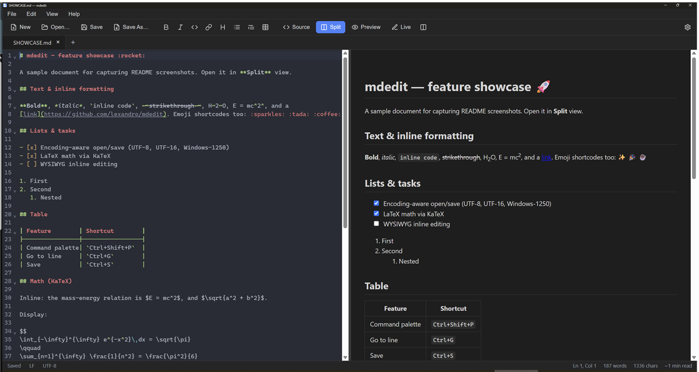
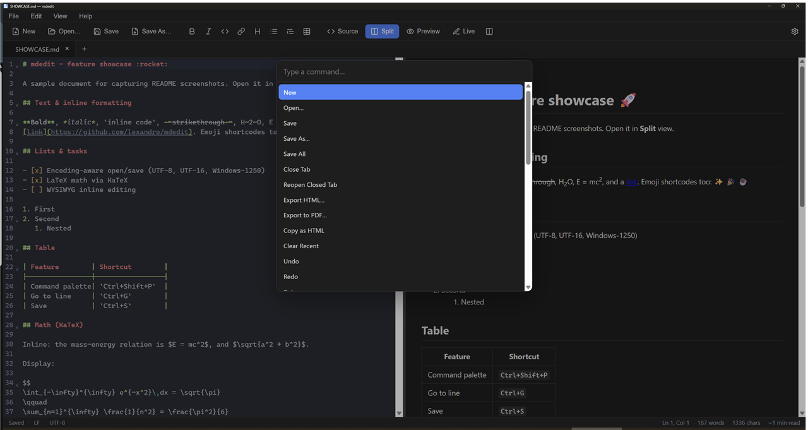
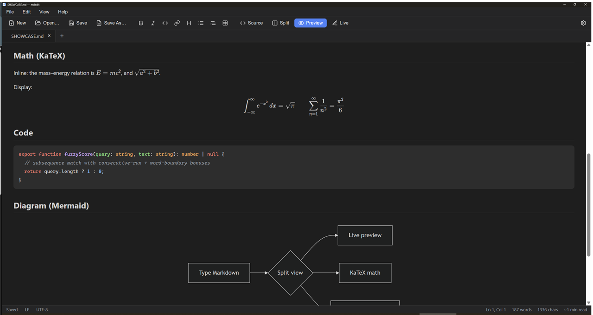
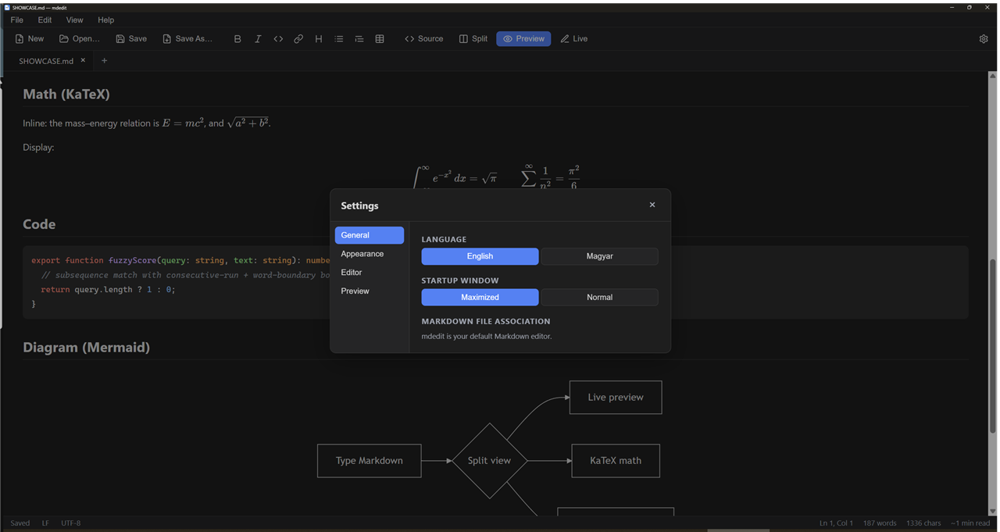

# mdedit

[](https://winstall.app/apps/lexandro.mdedit)
[](https://github.com/lexandro/mdedit/releases/latest)
[](./LICENSE)

A fast, native Windows **Markdown editor** built with [Tauri 2](https://tauri.app) (Rust) and [Svelte 5](https://svelte.dev). Small binary, native WebView2, no Electron bloat.

## Install

The quickest way is **winget** (built into Windows 10/11):

```powershell
winget install lexandro.mdedit
```

Other options:

- **Chocolatey**: `choco install mdedit` (pending first-time moderation)
- **Installer**: grab the `.msi` or `.exe` from the [latest release](https://github.com/lexandro/mdedit/releases/latest)

Updates arrive through the same channel you installed from — and the app also
has a built-in updater (Settings → **Check for updates**).

## Features

**Editing**

- **Four view modes** — source, rendered preview, split, and a **Live (WYSIWYG)** mode (Ctrl+4) that styles Markdown inline — headings, bold/italic/code, links, images, tables, fenced code, Mermaid, KaTeX math and task checkboxes render in place, revealing raw Markdown only on the line you're editing
- **Multi-tab** editing — drag to reorder, right-click for Close / Close Others / Close to the Right / Copy Path / Open Containing Folder, **Reopen Closed Tab**, and full **session restore** on restart
- **CodeMirror 6** source editor — Markdown syntax highlighting, **auto-closing** brackets/quotes, smart list continuation, **Find & Replace** (Ctrl+F), word-wrap toggle, and font zoom (Ctrl + wheel or Ctrl +/−/0)
- **Snippets** — a fuzzy **Insert Snippet…** picker (Ctrl+J) or inline triggers (`/date`, `/code`, `/table`…); tab-stop fields and date/time variables with a configurable format
- **Optional autosave** with a configurable delay, and optional **native spell check** (system / English / Magyar) — both off by default

**Rendering**

- **GitHub Flavored Markdown** — tables, task lists, autolinks, fenced code
- **Extensions** — footnotes, definition lists, sub/superscript, and `:shortcode:` **emoji**
- **LaTeX math** via [KaTeX](https://katex.org) — inline `$…$` and display `$$…$$`
- **Mermaid diagrams** and **code block syntax highlighting** (highlight.js)

**Productivity**

- **Command palette** (Ctrl+Shift+P) — fuzzy search over every command
- **In-app emoji picker** (Edit → Insert Emoji…) and **Go to Line** (Ctrl+G)
- **Document outline**, and **Recent files** with pin & clear
- **Export to HTML / PDF**, and **Copy as HTML**

**Files & UI**

- **Encoding-aware** I/O — UTF-8 (+BOM), UTF-16 LE/BE, and a **Windows-1250** fallback; line-ending toggle (LF/CRLF)
- **Paste images** from the clipboard (saved next to the document) and **drag-and-drop** files to open
- **Themes** (Dark / Light / System), interface zoom, and **localized UI** (English / Hungarian)
- **Auto-updater**, error toasts, and a status bar with cursor position, word/character count and reading time

> Live mode is a CodeMirror-based inline rendering (Obsidian "Live Preview"
> style): the document stays plain Markdown under the hood, so saving, encoding
> and sessions are unaffected, and you can switch back to Source/Split anytime.

## Screenshots

| Split view | Command palette |
|---|---|
|  |  |

| Math & diagrams | Settings |
|---|---|
|  |  |

## Tech stack

| Layer | Choice |
|---|---|
| Shell | Tauri 2 (Rust) + WebView2 |
| Frontend | Svelte 5 + SvelteKit (SPA) + Vite + TypeScript |
| Source editor | CodeMirror 6 |
| Rendering | markdown-it + Mermaid + highlight.js, sanitized with DOMPurify |

## Prerequisites

- [Bun](https://bun.sh) (package manager / scripts)
- [Rust](https://rustup.rs) (stable toolchain)
- Windows 10/11 with **WebView2** runtime (preinstalled on Windows 11)
- See the [Tauri prerequisites](https://tauri.app/start/prerequisites/) for the full list (Microsoft C++ Build Tools)

## Development

```bash
bun install          # install frontend dependencies
bun run tauri dev    # launch the app in dev mode (hot reload)
```

## Build

```bash
bun run tauri build  # produces a native installer + .exe under src-tauri/target/release
```

## Releasing

Push a `vX.Y.Z` tag and CI builds signed installers, publishes the GitHub
Release, and submits to winget and Chocolatey. The full maintainer runbook
(signing keys, winget/Chocolatey setup, the in-app updater) is in
[docs/RELEASING.md](docs/RELEASING.md).

## Security

Rendered Markdown is untrusted input, so the preview is defended in depth:

1. `markdown-it` runs with `html: false` (raw HTML in the source is escaped).
2. The rendered HTML is sanitized with **DOMPurify** before insertion.
3. A strict **Content Security Policy** is enforced on the WebView
   (`src-tauri/tauri.conf.json` → `app.security.csp`):
   - `script-src 'self'` — no inline/injected scripts (Tauri auto-hashes the
     app's own bootstrap script); `object-src 'none'`, `base-uri 'self'`.
   - `style-src 'self' 'unsafe-inline'` — required because CodeMirror and Mermaid
     inject styles at runtime (styles can't execute code, so this is low-risk).
   - `img-src` also allows `https:` and `data:` so remote/inline preview images load.
   - A looser `devCsp` (adds `'unsafe-inline' 'unsafe-eval'` + `ws:`/`http:` localhost)
     is used **only** under `tauri dev` for Vite HMR; it never ships.

> The updater's network requests run in Rust (reqwest), so they are not subject
> to the WebView CSP — `connect-src` only needs `ipc:`.

> **If Mermaid diagrams ever fail to render in a production build** with a CSP
> error about `eval`, add `'wasm-unsafe-eval'` (or, as a last resort,
> `'unsafe-eval'`) to `script-src` in the production `csp`. Current Mermaid (v11)
> is expected to work without it.

## Project layout

```
src/                 SvelteKit frontend (UI, editor, preview, stores)
src-tauri/           Rust backend (file I/O commands, window, menu, config)
```

## Roadmap

Planned work and the reasoning behind it live in [ROADMAP.md](./ROADMAP.md) —
next up: a visual table editor.

## License

[MIT](./LICENSE)
