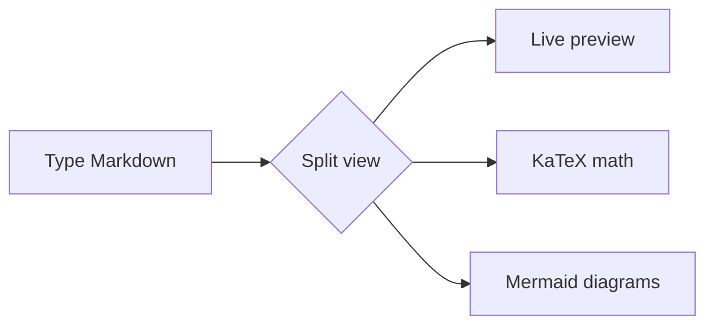

# mdedit — feature showcase :rocket:

A sample document for capturing README screenshots. Open it in **Split** view.

## Text & inline formatting

**Bold**, *italic*, `inline code`, ~~strikethrough~~, H~2~O, E = mc^2^, and a
[link](https://github.com/lexandro/mdedit). Emoji shortcodes too: :sparkles: :tada: :coffee:

## Lists & tasks

- [x] Encoding-aware open/save (UTF-8, UTF-16, Windows-1250)
- [x] LaTeX math via KaTeX
- [ ] WYSIWYG inline editing

1. First
2. Second
   1. Nested

## Table

| Feature        | Shortcut        |
|----------------|-----------------|
| Command palette| `Ctrl+Shift+P`  |
| Go to line     | `Ctrl+G`        |
| Save           | `Ctrl+S`        |

## Math (KaTeX)

Inline: the mass–energy relation is $E = mc^2$, and $\sqrt{a^2 + b^2}$.

Display:

$$
\int_{-\infty}^{\infty} e^{-x^2}\,dx = \sqrt{\pi}
\qquad
\sum_{n=1}^{\infty} \frac{1}{n^2} = \frac{\pi^2}{6}
$$

## Code

```ts
export function fuzzyScore(query: string, text: string): number | null {
  // subsequence match with consecutive-run + word-boundary bonuses
  return query.length ? 1 : 0;
}
```

## Diagram (Mermaid)



## Footnote

mdedit renders footnotes[^1] in the preview.

[^1]: Like this one.
